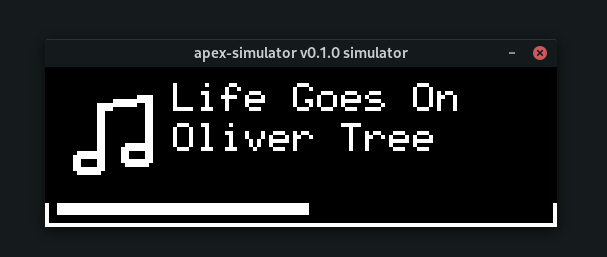
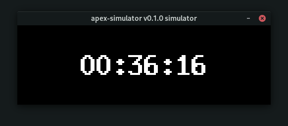
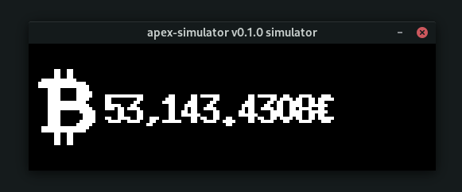
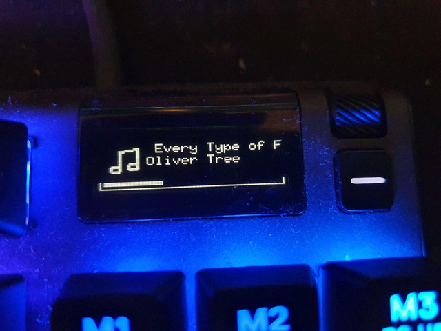
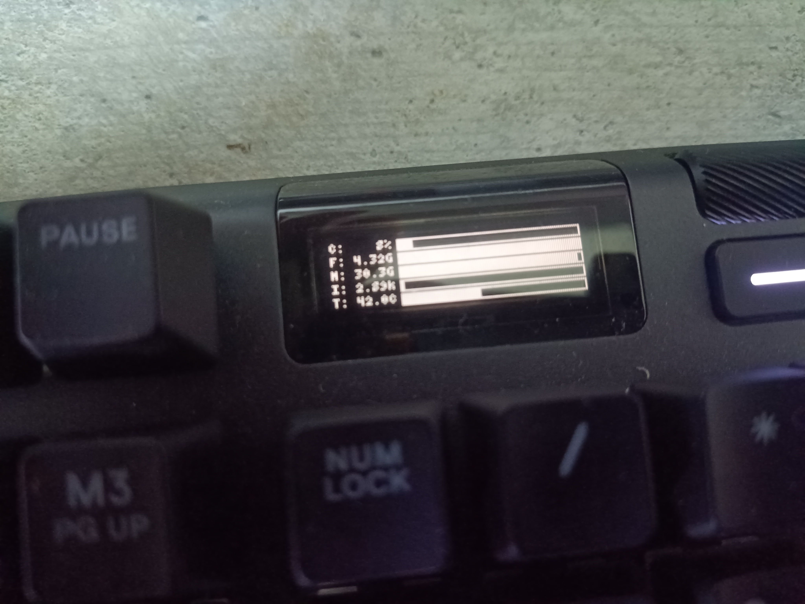

# apex-tux - Linux support for the Apex series OLED screens

Make use of your OLED screen instead of letting the SteelSeries logo burn itself in :-)

## Screenshots









## Features

- Music player integration (requires DBus)
- Discord notifications (requires DBus)
- Bitcoin price
- Clock
- System metrics
- Scrolling text
- No burn-in from constantly displaying a static image

## Supported media players

- [Lollypop](https://gitlab.gnome.org/World/lollypop) (tested)
- Firefox (Results may vary)
- Chromium / Chrome (Results may vary)
- mpv
- Telegram
- VLC
- Spotify

Source: [Arch Wiki](https://wiki.archlinux.org/title/MPRIS#Supported_clients)

## Supported devices

This currently supports the following devices:

- Apex Pro
- Apex 5
- Apex 7 (untested)

Other devices may be compatible and all that is needed is to add the ID to apex-hardware/src/usb.rs.

## Installation

For installing this software, follow the steps:

### UDev

1. Get the device id: `lsusb | grep "SteelSeries Apex"`:

```shell
$ lsusb | grep "SteelSeries Apex"
Bus 001 Device 002: ID 1038:1610 SteelSeries ApS SteelSeries Apex Pro
```

The **id** is the left part of the ID.

2. Enter the following data from [here](https://gist.github.com/ToadKing/d26f8f046a3b707e9e4b9821be5c9efc) (Shoutout [to @ToadKing](https://github.com/ToadKing)).

If those don't work and lead to an "Access denied" error please try the following rules and save the rules as `97-steelseries.rules`:

```shell
cat /etc/udev/rules.d/97-steelseries.rules
SUBSYSTEM=="input", GROUP="input", MODE="0666"

SUBSYSTEM=="usb", ATTRS{idVendor}=="1038", ATTRS{idProduct}=="1610", MODE="0666", GROUP="plugdev"
KERNEL=="hidraw*", ATTRS{idVendor}=="1038", ATTRS{idProduct}=="1610", MODE="0666", GROUP="plugdev"
```

3. Replace the `ATTRS{idVendor}==` value with the device **id**.

4. Save all files to `/etc/udev/rules.d/97-steelseries.rules`.

5. Finally, reload the `udev` rules: `sudo udevadm control --reload && sudo udevadm trigger`

### Rust

- Install Rust **nightly** using [rustup](https://rustup.rs/)
- Install required dependencies
  - For Ubuntu: `sudo apt install libssl-dev dbus-dev libusb-1.0-0-dev`
- Clone the repository: `git clone git@github.com:not-jan/apex-tux.git`
- Change directory into the repository: `cd apex-tux`
- Compile the app using the features you want
  - If you **don't** run DBus you have to disable the dbus feature: `cargo build --release --no-default-features --features crypto,usb`
  - Otherwise just run `cargo build --release --features sysinfo,hotkeys,gif`
  - If you **don't** have an Apex device around at the moment or want to develop more easily you can enable the simulator: `cargo build --release --no-default-features --features crypto,clock,dbus-support,simulator`

## Configuration

The default configuration is in `settings.toml`.
This repository ships with a default configuration that covers most parts and contains documentation for the important keys.

You can also run the software to find errors on configuration and to decide what is the right setup you need:

```shell
   ~/Pr/apex-tux    master !1    target/release/apex-tux                         ✔  10s  
23:43:05 [INFO] Registering MPRIS2 display source.
23:43:05 [INFO] Registering Sysinfo display source.
23:43:05 [WARN] Couldn't find network interface `eth0`
23:43:05 [INFO] Instead, found those interfaces:
23:43:05 [INFO]         lo
23:43:05 [INFO]         wlp3s0
23:43:05 [INFO]         enp2s0
23:43:05 [INFO]         docker0
23:43:05 [WARN] Couldn't find sensor `hwmon0 CPU Temperature`
23:43:05 [INFO] Instead, found those sensors:
23:43:05 [INFO]         acpitz temp1: 67°C (max: 67°C / critical: 120°C)
23:43:05 [INFO]         amdgpu edge: 47°C (max: 47°C)
23:43:05 [INFO]         iwlwifi_1 temp1: 39°C (max: 39°C)
23:43:05 [INFO]         k10temp Tctl: 66.5°C (max: 66.5°C)
23:43:05 [INFO]         nvme Composite HFM001TD3JX013N temp1: 36.85°C (max: 36.85°C / critical: 84.85°C)
23:43:05 [INFO]         nvme Composite Samsung SSD 980 PRO 1TB temp1: 32.85°C (max: 32.85°C / critical: 84.85°C)
23:43:05 [INFO]         nvme Sensor 1 HFM001TD3JX013N temp2: 36.85°C (max: 36.85°C)
23:43:05 [INFO]         nvme Sensor 1 Samsung SSD 980 PRO 1TB temp2: 32.85°C (max: 32.85°C)
23:43:05 [INFO]         nvme Sensor 2 HFM001TD3JX013N temp3: 43.85°C (max: 43.85°C)
23:43:05 [INFO]         nvme Sensor 2 Samsung SSD 980 PRO 1TB temp3: 38.85°C (max: 38.85°C)
23:43:05 [INFO] Registering Clock display source.
23:43:05 [INFO] Registering Gif display source.
23:43:05 [INFO] Registering Coindesk display source.
23:43:05 [INFO] Registering DBUS notification source.
23:43:05 [INFO] Found 5 registered providers
23:43:05 [INFO] Trying to connect to DBUS with player preference: Some("spotify")
23:43:05 [INFO] Trying to connect to DBUS with player preference: Some("spotify")
23:43:05 [INFO] Connected to music player: "org.mpris.MediaPlayer2.spotify"
```

In our case we need to choose a right value for the sensor(`acpitz temp1`, critical temperatured one, i.e., cpu) and the network interface(`wlp3s0`, wifi).

## Usage

Simply run the binary under `target/release/apex-tux` and make sure the settings.toml is in your current directory.
The output should look something like this:

```shell
23:18:14 [INFO] register hotkey ALT+SHIFT+A
23:18:14 [INFO] register hotkey ALT+SHIFT+D
23:18:14 [INFO] Registering Coindesk display source.
23:18:14 [INFO] Registering Clock display source.
23:18:14 [INFO] Registering MPRIS2 display source.
23:18:14 [INFO] Registering DBUS notification source.
23:18:14 [INFO] Found 3 registered providers
23:18:14 [INFO] Trying to connect to DBUS with player preference: Some("Lollypop")
23:18:18 [INFO] Trying to connect to DBUS with player preference: Some("Lollypop")
23:18:18 [INFO] Connected to music player: "org.mpris.MediaPlayer2.Lollypop"
23:34:01 [INFO] Ctrl + C received, shutting down!
23:34:01 [INFO] unregister hotkey ALT+SHIFT+A
23:34:01 [INFO] unregister hotkey ALT+SHIFT+D
```

You may change sources by pressing **Alt+Shift+A** or **Alt+Shift+D** (This might not work on Wayland). The simulator uses the arrow keys.

## Use as service(in background)

TODO

## Development

If you have a feature to add or a bug to fix please feel free to open an issue or submit a pull request.

## TODO

- Windows support
- Test this on more than one Desktop Environment on X11
- More providers
  - Games?
  - GIFs?
- Change the USB crate to something async instead
- Add documentation on how to add custom providers
- Switch from GATs to async traits once there here
- Add support for more notifications
- Package this up for Debian/Arch/Flatpak etc.

## Windows support ETA wen?

I've written a stub for SteelSeries Engine support on Windows, there is an [API for mediaplayer metadata](https://microsoft.github.io/windows-docs-rs/doc/windows/Media/Control/struct.GlobalSystemMediaTransportControlsSessionManager.html) but my time is kind of limited and I don't run Windows all that often.
It will happen eventually but it's not a priority.

## Why nightly Rust?

Way too many cool features to pass up on :D
